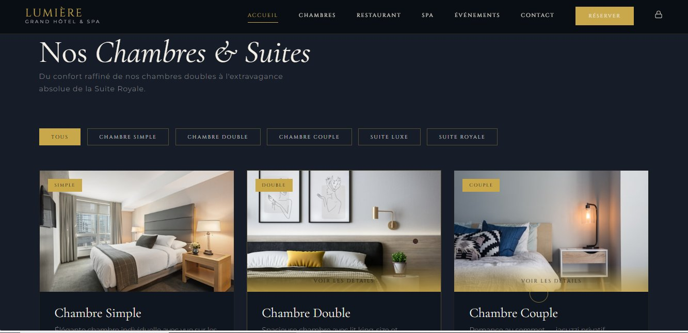
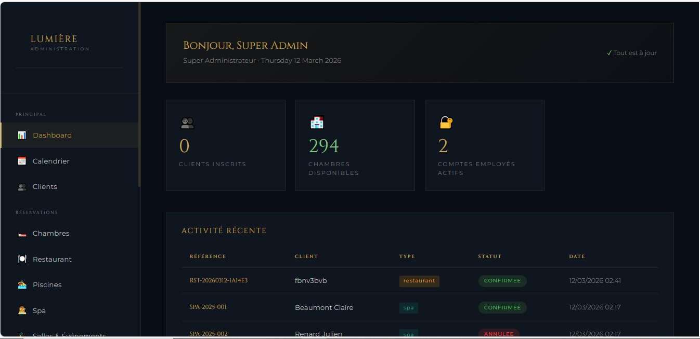
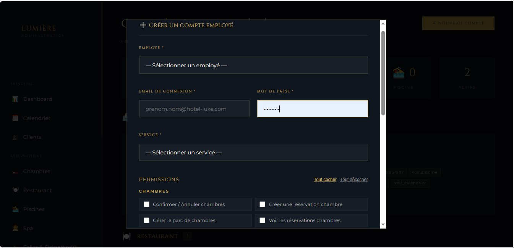

# 🏨 Hôtel Lumière — Système de Gestion Hôtelière

> Plateforme web complète de gestion d'un hôtel de luxe : réservations, employés, services et tableau de bord administratif.

<div align="center">


</div>

---

## 🎬 Aperçu du projet

### 🌐 Site Client — Page d'accueil


> *Interface publique au design luxury dark & gold : hero animé, navigation multi-services, appels à l'action réservation.*

---

### 🛏️ Catalogue des Chambres & Suites



> *Filtrage par type (Simple, Double, Couple, Suite Luxe, Suite Royale), cards avec photos réelles et modal de réservation intégré.*

---

### 📊 Dashboard Administrateur



> *Tableau de bord Super Admin : compteurs en temps réel (clients, chambres disponibles, comptes employés actifs), journal d'activité récente avec statuts colorés.*

---

### 👥 Création de Compte Employé



> *Modal de création de compte : sélection employé existant ou ajout d'un nouvel employé, email, mot de passe, service et permissions granulaires par module.*

---

## 📋 Table des matières

- [Aperçu](#-aperçu-du-projet)
- [Fonctionnalités](#fonctionnalités)
- [Stack technique](#stack-technique)
- [Structure du projet](#structure-du-projet)
- [Installation](#installation)
- [Configuration](#configuration)
- [Base de données](#base-de-données)
- [Rôles & Permissions](#rôles--permissions)
- [Sécurité](#sécurité)

---

## Fonctionnalités

### 🌐 Site client (hotel-html/)
- Page d'accueil avec présentation des services
- Catalogue des chambres avec filtres et modal de détail
- Formulaires de réservation en ligne (chambres, restaurant, spa, piscine, événements)
- Calcul de prix dynamique via API
- Vérification de disponibilité en temps réel

### 🔧 Espace d'administration (admin/)

| Module | Description |
|---|---|
| **Dashboard** | Vue globale : réservations en attente, statistiques, dernières activités |
| **Réservations Chambres** | Suivi, confirmation, annulation des réservations |
| **Réservations Restaurant** | Gestion des tables et créneaux |
| **Réservations Spa** | Planning des soins |
| **Réservations Piscine** | Créneaux et capacité |
| **Réservations Salles** | Gestion des événements et salles de conférence |
| **Chambres** | Parc hôtelier : statut, types, tarifs |
| **Clients** | Base clients et historique |
| **Employés** | Fiche RH, matricule, poste, salaire, statut |
| **Gestion des Comptes** | Accès employés, rôles, permissions granulaires |
| **Calendrier** | Vue calendrier multi-services |
| **Statistiques** | Graphiques de performance et occupation |

### 🔐 Système d'authentification
- Double authentification : admins et comptes employés distincts
- Sessions PHP sécurisées
- Contrôle d'accès par rôle sur chaque page

---

## Stack technique

| Couche | Technologie |
|---|---|
| **Backend** | PHP 8+ (procédural, PDO) |
| **Base de données** | MySQL 5.7+ / MariaDB 10.5+ |
| **Frontend client** | HTML5, CSS3, JavaScript vanilla |
| **Frontend admin** | PHP templating, CSS custom (thème luxury dark) |
| **API interne** | Endpoints PHP JSON (réservations, disponibilité, calcul prix) |
| **Sécurité** | `password_hash` BCrypt, requêtes préparées PDO, `htmlspecialchars` |

---

## Structure du projet

```
hotel-luxe/
├── admin/                        # Interface d'administration
│   ├── includes/
│   │   └── sidebar.php           # Navigation latérale
│   ├── css/
│   │   └── admin.css             # Thème admin dark luxury
│   ├── dashboard.php
│   ├── gestion_comptes.php       # Comptes employés & permissions
│   ├── employes.php              # Gestion RH
│   ├── chambres.php
│   ├── clients.php
│   ├── calendrier.php
│   ├── statistiques.php
│   ├── reservations_chambres.php
│   ├── reservations_restaurants.php
│   ├── reservations_spa.php
│   ├── reservations_piscines.php
│   ├── reservations_salles.php
│   ├── login.php
│   ├── logout.php
│   └── ajax_notif.php
│
├── api/                          # Endpoints JSON
│   ├── reserver_chambre.php
│   ├── reserver_restaurant.php
│   ├── reserver_spa.php
│   ├── reserver_piscine.php
│   ├── reserver_evenement.php
│   ├── calcul_prix.php
│   └── verifier_disponibilite.php
│
├── config/
│   └── database.php              # Connexion PDO centralisée
│
├── includes/
│   └── functions.php             # Fonctions utilitaires & auth
│
├── database/
│   ├── hotel.sql                 # Schéma principal + données de test
│   ├── hotel_addon.sql           # Tables additionnelles
│   └── migration_comptes_employes.sql
│
├── hotel-html/                   # Site client public
│   ├── index.html
│   ├── css/
│   │   ├── style.css
│   │   ├── animations.css
│   │   └── modal-chambre.css
│   ├── js/
│   │   ├── main.js
│   │   ├── reservation.js
│   │   ├── filters.js
│   │   └── room-modal.js
│   ├── pages/
│   │   ├── chambres.html
│   │   ├── restaurant.html
│   │   ├── spa.html
│   │   ├── evenements.html
│   │   └── contact.html
│   └── reservations/
│       └── reservation.html
│
└── docs/
    └── screenshots/              # Captures d'écran du projet
        ├── accueil.png
        ├── chambres.png
        ├── dashboard.png
        └── gestion-comptes.png
```

---

## Installation

### Prérequis

- PHP >= 8.0
- MySQL >= 5.7 ou MariaDB >= 10.5
- Apache avec `mod_rewrite` activé (ou Nginx)
- phpMyAdmin (recommandé) ou client MySQL

### Étapes

**1. Cloner ou déposer le projet**
```bash
# Pour XAMPP / WAMP
cp -r hotel-luxe/ C:/xampp/htdocs/

# Pour Apache Linux
cp -r hotel-luxe/ /var/www/html/
```

**2. Importer la base de données** — dans cet ordre :

```bash
mysql -u root -p < database/hotel.sql
mysql -u root -p < database/hotel_addon.sql
mysql -u root -p < database/migration_comptes_employes.sql
```

**3. Configurer la connexion** — éditer `config/database.php` :
```php
define('DB_HOST', 'localhost');
define('DB_NAME', 'hotel_luxe');
define('DB_USER', 'votre_utilisateur');
define('DB_PASS', 'votre_mot_de_passe');
```

**4. Créer un compte super-admin**

Le script `hotel.sql` insère un compte super-admin de démonstration. Après l'installation, connecte-toi avec ce compte puis change immédiatement son mot de passe depuis l'interface d'administration (ou directement en base via un hash `password_hash()` généré côté PHP).

**5. Accéder à l'application**

| Interface | URL |
|---|---|
| Site client | `http://localhost/hotel-luxe/hotel-html/` |
| Administration | `http://localhost/hotel-luxe/admin/login.php` |

---

## Configuration

```php
// config/database.php
define('DB_HOST',    'localhost');   // Hôte MySQL
define('DB_NAME',    'hotel_luxe'); // Nom de la base
define('DB_USER',    'root');       // ⚠️ Changer en production
define('DB_PASS',    '');           // ⚠️ Changer en production
define('DB_CHARSET', 'utf8mb4');
```

> ⚠️ **En production** : utiliser un utilisateur MySQL dédié avec les seuls droits `SELECT, INSERT, UPDATE, DELETE`. Ne jamais exposer `root`.

---

## Base de données

| Table | Description |
|---|---|
| `admins` | Comptes administrateurs |
| `users` | Clients enregistrés |
| `employees` | Fiches RH des employés |
| `employee_accounts` | Comptes employés + permissions JSON |
| `permissions_ref` | Référentiel des permissions |
| `room_types` | Types de chambres |
| `rooms` | Parc de chambres avec statut |
| `reservations` | Réservations de chambres |
| `restaurant_reservations` | Réservations restaurant |
| `spa_reservations` | Réservations spa |
| `piscine_reservations` | Réservations piscine |
| `event_reservations` | Réservations salles / événements |
| `activity_logs` | Journal d'activité |
| `attendance` | Présences & absences employés |

---

## Rôles & Permissions

### Rôles administrateurs

| Rôle | Accès |
|---|---|
| `superadmin` | Accès complet, gestion des comptes employés, statistiques |
| `manager` | Tableau de bord, réservations, clients |
| `receptionniste` | Réservations uniquement |

### Permissions employés

```
voir_chambres        approuver_chambres     creer_chambres     gerer_chambres
voir_restaurant      approuver_restaurant   creer_restaurant
voir_spa             approuver_spa          creer_spa
voir_piscine         approuver_piscine      creer_piscine
voir_salles          approuver_salles
voir_clients         voir_stats             voir_calendrier
```

---

## Sécurité

- Mots de passe hashés avec `password_hash()` (BCrypt, coût 12)
- Requêtes SQL via **requêtes préparées PDO** exclusivement
- Sorties HTML protégées par `htmlspecialchars()`
- Contrôle d'accès à chaque page (`requireSuperAdmin()`, `requireAdmin()`, `requireAnyAuth()`)
- Journal d'activité (`activity_logs`) pour la traçabilité complète
- Les identifiants de démonstration ne sont **jamais** exposés publiquement ; ils sont générés localement lors de l'installation et doivent être changés immédiatement après le premier accès

---

*Hôtel Lumière © 2025 — Projet de gestion hôtelière*
